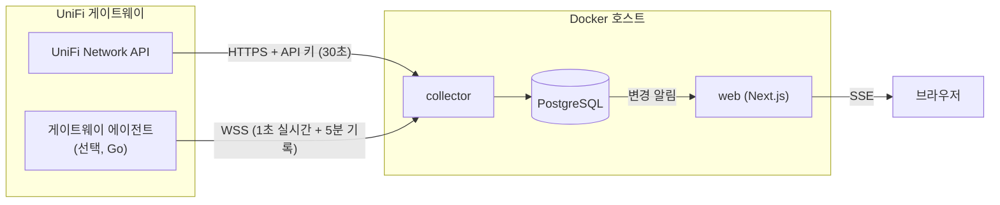

<div align="center">

# UniFi Traffic Monitor

**UniFi 게이트웨이의 클라이언트별 인터넷·내부 네트워크 사용량을 기록하고 실시간으로 보여주는 셀프 호스팅 대시보드**

[](https://github.com/aroxu/unifi-traffic-monitr/actions/workflows/publish-image.yml)
[](https://github.com/aroxu/unifi-traffic-monitr/actions/workflows/release-agent.yml)
[](https://github.com/aroxu/unifi-traffic-monitr/releases/latest)
[](https://github.com/aroxu/unifi-traffic-monitr/pkgs/container/unifi-traffic-monitr)


[빠른 시작](#빠른-시작) · [CA 인증서](#unifi-인증서ca-설정) · [게이트웨이 에이전트](#게이트웨이-에이전트-선택) · [사용 방법](#사용-방법) · [문제 해결](#문제-해결)

</div>

---

## 주요 기능

- **클라이언트별 사용량 기록**: 5분·1시간 단위로 저장하고, 30분부터 30일까지 기간별 그래프로 봅니다.
- **게이트웨이 직접 측정**: 선택 설치하는 [게이트웨이 에이전트](agent/README.md)가 UCG의 연결 추적(conntrack) 카운터를 읽어 **인터넷**과 **내부 네트워크** 사용량을 나눠 셉니다.
- **실시간 화면**: 에이전트가 연결되어 있으면 1초마다 현재 속도, 최근 1분 그래프, 오늘 누적 사용량이 갱신됩니다.
- **끊김 없는 기록**: 수집 서버가 멈춰 있던 동안의 5분 기록을 에이전트가 메모리에 최대 24시간 담아 두었다가, 다시 연결되면 채웁니다. 게이트웨이의 eMMC에는 트래픽 기록을 쓰지 않습니다.
- **UniFi API 연동**: 클라이언트 이름·IP·연결 장비·무선 신호, UniFi 장비 목록, 컨트롤러가 보고한 트래픽 카운터를 수집합니다.
- **관리자 로그인과 모바일 화면**: 공개 가입 없이 관리자 계정으로만 접근하고, 밝은/어두운 테마와 휴대폰 화면을 지원합니다.

## 구성



| 구성 요소 | 하는 일 |
| --- | --- |
| `collector` | UniFi API를 30초마다 읽고, 에이전트 스트림을 받아 PostgreSQL에 저장합니다. API 키와 에이전트 토큰은 이 컨테이너에만 전달됩니다. |
| `web` | 로그인, 대시보드, API를 제공합니다. DB가 바뀌면 열려 있는 화면을 자동으로 갱신합니다. |
| `db` | PostgreSQL 17. 모든 기록과 설정을 보관합니다. |
| 게이트웨이 에이전트 | UCG에 설치하는 선택 구성 요소입니다. 게이트웨이를 지나는 트래픽을 직접 셉니다. |

## 요구 사항

- UniFi OS 게이트웨이와 UniFi Network 애플리케이션. UCG Fiber(UniFi OS 5.1.33, Network 10.6.106)에서 검증했습니다.
- Docker Engine과 Docker Compose v2가 있는 호스트 (amd64 또는 arm64). 이 호스트에서 게이트웨이의 LAN 주소 443 포트로 연결할 수 있어야 합니다.
- UniFi Network API 키
- `openssl`과 `curl` (인증서 준비와 연결 확인용)

## 빠른 시작

공개 GHCR 이미지(`ghcr.io/aroxu/unifi-traffic-monitr:latest`)로 실행합니다. 소스 코드를 받을 필요는 없습니다.

### 1. 실행 파일 받기

```sh
mkdir unifi-traffic-monitor && cd unifi-traffic-monitor
base=https://raw.githubusercontent.com/aroxu/unifi-traffic-monitr/main/examples/ghcr
curl -fsSLO "$base/docker-compose.yml"
curl -fsSLO "$base/docker-compose.ca.yml"
curl -fsSL -o .env "$base/.env.example"
chmod 600 .env
```

### 2. UniFi API 키 만들기

UniFi 콘솔에서 **Network → Settings → Control Plane → Integrations → Create API Key**를 선택합니다. 키는 만들 때 한 번만 보이므로 바로 복사해 둡니다. 메뉴가 보이지 않으면 [Ubiquiti 안내](https://help.ui.com/hc/en-us/articles/30076656117655-Getting-Started-with-the-Official-UniFi-API)를 참고해 Network 애플리케이션을 업데이트하세요.

### 3. 게이트웨이 인증서 준비

UniFi OS의 기본 HTTPS 인증서는 게이트웨이가 스스로 만든 자체 서명 인증서입니다. 수집기는 TLS 검증을 끄지 않으므로 이 인증서를 신뢰 대상으로 지정해야 합니다. 대부분의 설치는 아래 세 줄이면 됩니다. 자세한 설명과 확인 방법은 [UniFi 인증서(CA) 설정](#unifi-인증서ca-설정)에 있습니다.

```sh
UNIFI_IP=192.168.1.1   # 게이트웨이 LAN 주소로 바꾸세요
openssl s_client -connect "$UNIFI_IP:443" -servername unifi.local </dev/null 2>/dev/null \
  | openssl x509 -outform PEM -out unifi-ca.pem
openssl x509 -in unifi-ca.pem -noout -subject -ext subjectAltName -fingerprint -sha256
```

### 4. 사이트 확인

인증서와 API 키가 맞는지 확인하면서, `.env`에 넣을 사이트 값도 얻습니다.

```sh
UNIFI_API_KEY='붙여넣은 API 키'
curl -fsS --cacert unifi-ca.pem --resolve "unifi.local:443:$UNIFI_IP" \
  -H "X-API-KEY: $UNIFI_API_KEY" \
  https://unifi.local/proxy/network/integration/v1/sites
```

```json
{"offset":0,"limit":25,"count":1,"totalCount":1,
 "data":[{"id":"0b1c2d3e-....","internalReference":"default","name":"Default"}]}
```

`id`는 `UNIFI_SITE_UUID`, `internalReference`는 `UNIFI_SITE`입니다. 여기서 오류가 나면 [문제 해결](#문제-해결)을 먼저 확인하세요.

### 5. `.env` 작성

```sh
# 무작위 값 두 개를 만듭니다.
openssl rand -base64 32   # POSTGRES_PASSWORD
openssl rand -base64 48   # BETTER_AUTH_SECRET
```

```ini
POSTGRES_PASSWORD=<무작위 값>
BETTER_AUTH_SECRET=<무작위 값>
BETTER_AUTH_URL=http://localhost:3000
ADMIN_EMAIL=admin@example.com
ADMIN_PASSWORD=<관리자 비밀번호>

UNIFI_URL=https://unifi.local
UNIFI_CONNECT_IP=192.168.1.1
UNIFI_API_KEY=<API 키>
UNIFI_SITE=default
UNIFI_SITE_UUID=<4단계의 id>

# 인증서 설정 (3단계에서 만든 파일의 절대 경로)
UNIFI_CA_HOST_FILE=/home/you/unifi-traffic-monitor/unifi-ca.pem
COMPOSE_FILE=docker-compose.yml:docker-compose.ca.yml
```

전체 변수는 [환경 변수](#환경-변수)를 참고하세요.

### 6. 실행과 로그인

```sh
docker compose pull
docker compose up -d
docker compose logs -f collector
```

`Collection succeeded: 40 clients, ...`가 보이면 수집이 시작된 것입니다. 브라우저에서 `http://localhost:3000`을 열고 `ADMIN_EMAIL`·`ADMIN_PASSWORD`로 로그인합니다. 관리자 계정은 **빈 DB에 처음 시작할 때만** 만들어집니다. 나중에 `.env`의 비밀번호를 바꿔도 기존 계정은 바뀌지 않습니다.

> [!TIP]
> 인터넷과 내부 네트워크를 나눠 보려면 [게이트웨이 에이전트](#게이트웨이-에이전트-선택)를 추가로 설치하세요. 에이전트가 없으면 UniFi가 보고한 카운터(`컨트롤러 보고` 범위)만 표시됩니다.

---

## UniFi 인증서(CA) 설정

수집기는 UniFi에 API 키를 보내기 전에 HTTPS 인증서를 검증합니다. 검증을 끄는 옵션은 일부러 두지 않았습니다. 검증 없이 연결하면 같은 네트워크의 다른 기기가 게이트웨이인 척 API 키를 가로챌 수 있기 때문입니다. 인증서 종류에 따라 설정이 다릅니다.

| UniFi가 쓰는 인증서 | 해야 할 일 |
| --- | --- |
| **기본 자체 서명 인증서** (대부분) | 게이트웨이 인증서 파일을 받아 수집기에 신뢰 대상으로 지정합니다. 아래 1~5단계를 따르세요. |
| 직접 만든 사설 CA로 발급한 인증서 | 그 CA의 루트 인증서를 지정합니다. [사설 CA를 쓰는 경우](#사설-ca나-공인-인증서를-쓰는-경우)를 보세요. |
| 공인 CA 인증서 (예: Let's Encrypt) | CA 파일이 필요 없습니다. `UNIFI_URL`만 인증서의 도메인으로 맞춥니다. |

### 1. 인증서 파일 받기

**방법 A. Docker 호스트에서 바로 받기 (권장)**

```sh
UNIFI_IP=192.168.1.1
openssl s_client -connect "$UNIFI_IP:443" -servername unifi.local </dev/null 2>/dev/null \
  | openssl x509 -outform PEM -out unifi-ca.pem
```

게이트웨이가 실제로 보내는 인증서를 저장합니다. 자체 서명 인증서는 인증서 하나가 스스로를 서명하므로, 이 파일 자체가 CA 역할을 합니다.

**방법 B. SSH로 게이트웨이에서 복사하기**

게이트웨이에 SSH를 켜 두었다면 원본 파일을 직접 복사할 수 있습니다. 기본 인증서는 `/data/unifi-core/config/unifi-core.crt`에 있습니다.

```sh
ssh root@192.168.1.1 cat /data/unifi-core/config/unifi-core.crt > unifi-ca.pem
```

> [!CAUTION]
> 옆에 있는 `unifi-core.key`는 게이트웨이의 **개인 키**입니다. 복사하거나 공유하지 마세요. 수집기에는 인증서(`.crt`)만 필요합니다. 인증서는 공개 정보라서 비밀로 둘 필요는 없습니다.

**받은 인증서가 진짜인지 확인하기**

방법 A는 네트워크로 받은 인증서입니다. 한 번은 게이트웨이의 원본과 지문이 같은지 비교하세요. SSH로 원본 지문을 확인하거나, 브라우저로 `https://게이트웨이IP`에 접속해 인증서 정보의 SHA-256 지문과 비교할 수 있습니다.

```sh
openssl x509 -in unifi-ca.pem -noout -fingerprint -sha256
ssh root@192.168.1.1 openssl x509 -in /data/unifi-core/config/unifi-core.crt -noout -fingerprint -sha256
```

### 2. 인증서 이름 확인하기

```sh
openssl x509 -in unifi-ca.pem -noout -subject -issuer -enddate -ext subjectAltName
```

```text
subject=CN=unifi.local
issuer=CN=unifi.local
notAfter=Dec 30 03:39:10 2027 GMT
X509v3 Subject Alternative Name:
    DNS:unifi.local, DNS:localhost, DNS:[::1], IP Address:127.0.0.1, IP Address:FE80:0:0:0:0:0:0:1
```

- **`subject`와 `issuer`가 같으면** 자체 서명 인증서입니다. 이 파일을 그대로 CA로 씁니다.
- **`Subject Alternative Name`** 이 인증서가 인정하는 이름 목록입니다. 기본 인증서에는 게이트웨이의 LAN IP가 **없습니다**. 그래서 `UNIFI_URL`에 `https://192.168.1.1`처럼 IP를 쓰면 CA가 맞아도 이름 검증에서 실패합니다.
- **`notAfter`** 만료일입니다. 이 날짜가 지나기 전에 게이트웨이 인증서가 바뀌면 파일도 다시 받아야 합니다.

### 3. `.env`에 연결 정보 넣기

```ini
# 인증서 이름 목록에 있는 이름을 주소로 씁니다.
UNIFI_URL=https://unifi.local
# 그 이름을 DNS 대신 이 IP로 연결합니다. TLS 이름 검증은 unifi.local로 합니다.
UNIFI_CONNECT_IP=192.168.1.1
# Docker 호스트에 있는 PEM 파일의 절대 경로
UNIFI_CA_HOST_FILE=/home/you/unifi-traffic-monitor/unifi-ca.pem
# docker compose 명령에 CA 오버라이드를 항상 포함합니다.
COMPOSE_FILE=docker-compose.yml:docker-compose.ca.yml
```

`UNIFI_CONNECT_IP`가 있으면 `unifi.local`을 DNS에서 찾지 않고 지정한 IP로 연결합니다. 접속 주소와 인증서 이름을 따로 맞출 수 있어서, 호스트의 `/etc/hosts`를 고칠 필요가 없습니다.

`docker-compose.ca.yml`은 호스트의 파일을 컨테이너 안의 고정 경로에 읽기 전용으로 연결합니다.

| 위치 | 경로 | 누가 정하나 |
| --- | --- | --- |
| Docker 호스트 | `UNIFI_CA_HOST_FILE` 값 (예: `/home/you/unifi-traffic-monitor/unifi-ca.pem`) | 사용자가 `.env`에 적습니다. |
| collector 컨테이너 | `/run/secrets/unifi-ca.pem` (읽기 전용) | 오버라이드가 연결하고 `UNIFI_CA_FILE`로 알려 줍니다. |

> [!IMPORTANT]
> `.env`에는 **`UNIFI_CA_HOST_FILE`만** 적습니다. `UNIFI_CA_FILE`은 컨테이너 **안의** 경로라서 오버라이드가 자동으로 설정합니다. `UNIFI_CA_FILE`에 호스트 경로를 적으면 컨테이너가 파일을 찾지 못해 `Cannot read UNIFI_CA_FILE`(예전 버전은 `ENOENT`) 오류로 멈춥니다.

`COMPOSE_FILE`을 쓰지 않으려면 매번 두 파일을 함께 지정합니다.

```sh
docker compose -f docker-compose.yml -f docker-compose.ca.yml up -d
```

### 4. 적용과 확인

```sh
# 오버라이드가 포함되었는지
docker compose config | grep -A2 unifi-ca.pem
# 컨테이너 안에 파일이 보이는지
docker compose up -d
docker compose exec collector head -1 /run/secrets/unifi-ca.pem
# 수집 결과
docker compose logs --tail 20 collector
```

`-----BEGIN CERTIFICATE-----`가 보이고 로그에 `Collection succeeded`가 나오면 완료입니다. 실패하면 로그의 `Collector cycle failed: <코드>`와 **상태·설정** 화면의 최근 수집 기록에 원인 코드가 표시됩니다. 코드별 해결 방법은 [인증서 오류](#인증서-오류)에 있습니다.

### 5. 인증서가 바뀌었을 때

UniFi 콘솔 초기화, 인증서 교체, 만료 후 재발급이 있으면 인증서 지문이 바뀝니다. 그러면 수집이 `tls_untrusted_certificate`로 실패합니다. 1단계로 파일을 다시 받아 같은 경로에 덮어쓴 뒤 수집기를 다시 시작합니다. 수집기는 시작할 때 인증서를 읽습니다.

```sh
docker compose restart collector
```

### 사설 CA나 공인 인증서를 쓰는 경우

- **사설 CA:** `UNIFI_CA_HOST_FILE`에 게이트웨이 인증서가 아니라 **발급한 CA의 루트 인증서**를 지정합니다. 중간 CA가 있고 게이트웨이가 체인을 함께 보내지 않는다면, 중간 CA와 루트 인증서를 한 PEM 파일에 이어 붙입니다. `UNIFI_URL`은 인증서에 들어 있는 이름으로 씁니다.
- **공인 인증서:** `UNIFI_CA_HOST_FILE`과 `COMPOSE_FILE` 줄을 지웁니다. `UNIFI_URL=https://<인증서 도메인>`으로 설정하고, 그 도메인이 LAN에서 게이트웨이로 연결되지 않으면 `UNIFI_CONNECT_IP`를 함께 지정합니다.

> [!NOTE]
> [게이트웨이 에이전트](#게이트웨이-에이전트-선택)는 위 CA 설정을 쓰지 않습니다. 에이전트는 설치할 때 자체 인증서를 만들고, 수집기는 그 **SHA-256 지문**(`UNIFI_AGENT_CERT_SHA256`)으로 확인합니다.

---

## 게이트웨이 에이전트 (선택)

에이전트를 설치하면 게이트웨이가 직접 센 **인터넷**·**내부 네트워크** 사용량과 1초 단위 실시간 속도를 볼 수 있습니다. 프로그램과 설정은 게이트웨이의 `/data`에 들어가므로 재부팅과 펌웨어 업데이트 뒤에도 유지됩니다. 측정값은 메모리에만 두고 수집기로 보내며, 에이전트는 디스크에 쓰지 않습니다.

1. UniFi 콘솔에서 SSH를 켜고 root로 접속합니다. 방법은 [Ubiquiti SSH 안내](https://help.ui.com/hc/en-us/articles/204909374-Connecting-to-UniFi-with-Debug-Tools-SSH)에 있습니다.
2. 설치 스크립트를 실행합니다.

   ```sh
   curl -sSLf https://raw.githubusercontent.com/aroxu/unifi-traffic-monitr/main/agent/install.sh | sh
   ```

3. 출력된 값과 토큰을 확인합니다.

   ```sh
   /data/unifi-traffic-agent/manage.sh info    # Stream URL, Certificate
   /data/unifi-traffic-agent/manage.sh token   # 토큰
   ```

4. 수집 서버의 `.env`에 세 값을 넣고 수집기를 다시 만듭니다.

   ```ini
   UNIFI_AGENT_URL=wss://192.168.1.1:8790/v1/stream
   UNIFI_AGENT_TOKEN=<manage.sh token 출력>
   UNIFI_AGENT_CERT_SHA256=<manage.sh info의 Certificate 값>
   ```

   ```sh
   docker compose up -d collector
   docker compose logs collector | grep 'Gateway agent'
   ```

`Gateway agent v0.1.x connected`가 보이면 개요 화면에 실시간 카드가 나타납니다. 측정 범위, 관리 명령, 프로토콜은 [agent/README.md](agent/README.md)에 정리했습니다.

---

## 사용 방법

### 화면

| 화면 | 내용 |
| --- | --- |
| **개요** | 실시간 속도·오늘 사용량(에이전트), 클라이언트 온라인/오프라인 수, 최근 수집 상태, 최근 24시간 트래픽, 사용량 상위 클라이언트 |
| **클라이언트** | 이름·IP·MAC 검색, 유선/무선과 연결 장비 필터, 정렬, 페이지당 개수 조정 |
| **클라이언트 상세** | 연결 정보, 무선 신호·잡음, 실시간 속도와 오늘 사용량, 30분~30일 기간별 사용량 그래프 |
| **장비** | UniFi 장비 목록과 장비별 연결 클라이언트. 클라이언트 수를 누르면 해당 장비로 필터링된 목록이 열립니다. |
| **상태·설정** | 에이전트 연결 상태, 최근 수집 기록과 오류 코드, 데이터 보존 기간 |

화면은 수집 결과가 저장될 때마다 새로고침 없이 갱신됩니다. 브라우저 탭을 숨기면 연결을 닫고, 다시 보면 이어서 받습니다.

### 사용량 범위

| 범위 | 출처 | 포함하는 트래픽 |
| --- | --- | --- |
| **인터넷(게이트웨이 측정)** | 게이트웨이 에이전트 | WAN으로 나가고 들어온 트래픽 |
| **LAN(게이트웨이 경유)** | 게이트웨이 에이전트 | 게이트웨이 자신 또는 다른 내부 네트워크(VLAN)와 주고받은 트래픽 |
| **컨트롤러 보고** | UniFi API 카운터 | UniFi가 보고한 값입니다. 인터넷과 LAN이 섞일 수 있고 실제 전송량과의 오차는 확인하지 않았습니다. |

에이전트가 있으면 화면은 인터넷 범위를 먼저 보여주고, 클라이언트 상세에서 범위를 바꿀 수 있습니다.

> [!NOTE]
> 같은 네트워크 안에서 스위치로만 오가는 통신(기기 A ↔ 스위치 ↔ 기기 B)은 게이트웨이를 지나지 않아 에이전트가 볼 수 없습니다. 같은 가상화 호스트 안의 VM끼리 주고받는 통신도 마찬가지입니다.

### 데이터 보존

**상태·설정** 화면에서 원본 샘플·상세 구간(기본 3일), 5분 집계(90일), 1시간 집계(365일)의 보존 기간을 바꿀 수 있습니다. 원본 ≤ 5분 ≤ 1시간 순서여야 합니다. 오래된 상세 기록은 집계에 합계를 남긴 뒤에 지웁니다. 24시간 이하 그래프는 5분 집계를, 7일·30일 그래프는 1시간 집계를 읽습니다.

게이트웨이 에이전트가 보낸 5분 원본 기록도 원본 샘플 기간을 따릅니다. 수집기가 꺼져 있던 동안의 기록은 에이전트가 다시 연결될 때 보내 주므로, 마지막으로 받은 기록 이후의 행과 그 시간대의 5분 집계는 최대 8일까지 남겨 둡니다. 같은 값이 5분·1시간 집계에 남아 있으므로 화면에서 사라지는 기록은 없습니다. 최근 수집 기록은 최소 30일 보관합니다.

정리 작업은 UniFi API 수집이 실패하는 동안에도 1시간마다 실행되고, 한 번에 표마다 최대 10만 행을 지웁니다. 보존 기간을 크게 줄이면 남은 행은 다음 정리 작업에서 이어서 지웁니다.

> [!TIP]
> PostgreSQL은 지운 행의 공간을 새 기록에 다시 쓰지만 디스크로 돌려주지는 않습니다. 보존 기간을 줄인 뒤 디스크 공간을 바로 돌려받으려면 정리가 끝난 다음 아래 명령을 실행하세요. 실행하는 동안 각 표가 잠시 잠깁니다.
>
> ```bash
> docker compose exec db sh -c 'for t in client_samples traffic_intervals agent_buckets; do psql -U "$POSTGRES_USER" -d "$POSTGRES_DB" -c "VACUUM (FULL, ANALYZE) $t"; done'
> ```

---

## 환경 변수

| 변수 | 필수 | 설명 |
| --- | :---: | --- |
| `POSTGRES_PASSWORD` | ✅ | PostgreSQL 비밀번호 |
| `BETTER_AUTH_SECRET` | ✅ | 로그인 세션 서명 키. 32자 이상의 무작위 값 |
| `BETTER_AUTH_URL` | ✅ | 브라우저가 접속하는 주소. 예: `http://localhost:3000`, `https://traffic.example.com` |
| `ADMIN_EMAIL`, `ADMIN_PASSWORD` | ✅ | 빈 DB에서 처음 만들 관리자 계정 |
| `WEB_BIND`, `WEB_PORT` | | 웹을 열 주소와 포트. 기본 `127.0.0.1:3000` |
| `UNIFI_URL` | ✅ | UniFi의 HTTPS 주소. 인증서 이름과 같아야 합니다. 예: `https://unifi.local` |
| `UNIFI_CONNECT_IP` | | `UNIFI_URL`의 이름 대신 실제로 연결할 IP |
| `UNIFI_API_KEY` | ✅ | Network API 키 |
| `UNIFI_SITE`, `UNIFI_SITE_UUID` | ✅ | 사이트의 `internalReference`와 `id` |
| `UNIFI_CA_HOST_FILE` | | Docker 호스트에 있는 UniFi 인증서 PEM의 절대 경로 (`docker-compose.ca.yml`과 함께) |
| `COMPOSE_FILE` | | `docker-compose.yml:docker-compose.ca.yml`로 두면 CA 오버라이드를 항상 포함 |
| `UNIFI_WIRED_SCOPE`, `UNIFI_WIRELESS_SCOPE` | | API 카운터를 표시할 범위. 기본 `reported` |
| `UNIFI_WIRED_RX_DIRECTION`, `UNIFI_WIRELESS_RX_DIRECTION` | | API의 `rx`를 업로드로 볼지 다운로드로 볼지. 기본 `upload` |
| `COLLECT_INTERVAL_MS` | | API 수집 주기. 기본 30000 (10초~1시간) |
| `UNIFI_AGENT_URL`, `UNIFI_AGENT_TOKEN`, `UNIFI_AGENT_CERT_SHA256` | | 게이트웨이 에이전트 연결. 셋 다 쓰거나 모두 비웁니다. |

---

## 운영

### 업데이트

```sh
docker compose pull
docker compose up -d
```

DB 구조 변경은 `migrate` 서비스가 시작할 때 자동으로 적용합니다. 게이트웨이 에이전트는 게이트웨이에서 `/data/unifi-traffic-agent/manage.sh update`로 올립니다.

### 백업과 복원

```sh
# 백업
docker compose exec -T db pg_dump -U traffic -d traffic -Fc > "traffic-$(date +%Y%m%d).dump"

# 복원 (현재 DB를 백업 시점으로 되돌립니다)
docker compose stop web collector
docker compose exec -T db pg_restore --clean --if-exists --no-owner --no-privileges \
  -U traffic -d traffic < traffic-YYYYMMDD.dump
docker compose up -d web collector
```

### 다른 기기에서 접속하기

기본 설정은 Docker 호스트 자신(`127.0.0.1`)에서만 열립니다. LAN에서 접속하려면 `WEB_BIND=0.0.0.0`으로 바꾸고, `BETTER_AUTH_URL`을 브라우저에 입력할 주소와 똑같이 맞춥니다. 외부에 공개한다면 HTTPS 역방향 프록시 뒤에 두세요. 실시간 갱신은 `/api/overview/events`의 스트리밍 응답(SSE)을 쓰므로 프록시에서 이 경로의 버퍼링을 꺼야 합니다. 웹은 `X-Accel-Buffering: no` 헤더를 보냅니다.

### 로그

```sh
docker compose logs -f collector   # 수집 결과, 에이전트 연결
docker compose logs -f web
```

---

## 문제 해결

### 인증서 오류

로그의 `Collector cycle failed: <코드> (<원인>)` 또는 **상태·설정 → 최근 수집**의 코드를 확인하세요. 괄호 안의 원인은 로그에만 남습니다.

| 코드 / 메시지 | 원인 | 해결 |
| --- | --- | --- |
| `Cannot read UNIFI_CA_FILE ...` 또는 `ENOENT` | `UNIFI_CA_FILE`에 호스트 경로를 넣었거나 오버라이드가 빠짐 | `.env`에서 `UNIFI_CA_FILE`을 지우고 `UNIFI_CA_HOST_FILE`과 `COMPOSE_FILE`을 설정합니다. |
| `UNIFI_CA_FILE ... is not a PEM certificate` | 파일이 비었거나 형식이 다름 | 1단계로 다시 받습니다. 파일 첫 줄이 `-----BEGIN CERTIFICATE-----`여야 합니다. |
| `Set UNIFI_CA_HOST_FILE to an existing PEM file` (compose 오류) | 변수가 비어 있음 | 절대 경로를 넣습니다. |
| `bind source path does not exist` (compose 오류) | 호스트에 그 경로의 파일이 없음 | `ls -l "$UNIFI_CA_HOST_FILE"`로 경로를 확인합니다. |
| `tls_hostname_mismatch` | `UNIFI_URL`의 호스트가 인증서 이름 목록에 없음 (예: IP 주소) | `UNIFI_URL=https://unifi.local`과 `UNIFI_CONNECT_IP=<IP>`로 바꿉니다. |
| `tls_untrusted_certificate` | CA 파일이 연결되지 않았거나 게이트웨이 인증서가 바뀜 | `docker compose config \| grep unifi-ca`로 오버라이드 포함 여부를 보고, 인증서를 다시 받습니다. |
| `tls_certificate_expired` | 게이트웨이 인증서 만료 | UniFi에서 인증서를 갱신하고 파일을 다시 받습니다. |
| `tls_certificate_not_yet_valid` | 호스트나 게이트웨이의 시계가 틀림 | 두 장비의 NTP 설정을 확인합니다. |
| `UniFi URL must use HTTPS` | `UNIFI_URL`이 `http://` | `https://`로 바꿉니다. |

### 연결·인증 오류

| 코드 | 원인 | 해결 |
| --- | --- | --- |
| `dns_lookup_failed` | `unifi.local`을 찾지 못함 | `UNIFI_CONNECT_IP`를 지정합니다. |
| `connection_refused`, `host_unreachable`, `timeout` | 게이트웨이에 연결되지 않음 | 호스트에서 `curl` 확인 명령(빠른 시작 4단계)을 실행해 봅니다. 호스트에서는 되는데 컨테이너에서 안 되면 Docker 브리지가 LAN에 닿지 않는 환경입니다. 수집기에 `network_mode: host`를 지정하고, DB 접속은 호스트 포트로 연결합니다. 예시는 [deploy/compose.local.yaml](deploy/compose.local.yaml)을 참고하세요. |
| `http_401`, `http_403` | API 키가 틀렸거나 권한이 없음 | API 키를 새로 만듭니다. |
| `http_404` | 주소나 사이트 이름이 다름 | `UNIFI_URL`이 콘솔 주소인지, `UNIFI_SITE`가 `internalReference`와 같은지 확인합니다. |
| `unifi_site_mismatch` | `UNIFI_SITE_UUID`와 `UNIFI_SITE`가 다른 사이트를 가리킴 | 4단계의 `id`와 `internalReference`를 같은 항목에서 가져옵니다. |
| `unifi_response_invalid` | UniFi 응답의 형식이나 값이 예상과 다름 (예: 펌웨어 업데이트로 필드가 바뀜) | 로그의 괄호 안 원인을 확인합니다. MAC 주소가 없는 VPN·Teleport 클라이언트는 이 오류 없이 건너뜁니다. |

### 에이전트 오류

| 증상 | 해결 |
| --- | --- |
| 로그에 `certificate fingerprint mismatch` | 에이전트 인증서가 바뀌었습니다. `manage.sh info`의 `Certificate` 값을 다시 넣습니다. |
| 로그에 `HTTP 401` 또는 `HTTP 429` | 토큰이 틀렸습니다. 429는 1분에 5번 이상 실패한 경우라 잠시 뒤 다시 시도됩니다. |
| 실시간 카드가 "에이전트 연결 끊김" | 게이트웨이에서 `manage.sh status`로 실행 여부를 보고, 수집 서버에서 게이트웨이의 8790 포트로 연결되는지 확인합니다. |

---

## 개발

<details>
<summary>소스에서 실행하기</summary>

Node.js 24, pnpm 12.4.1, PostgreSQL 17이 필요합니다.

```sh
git clone https://github.com/aroxu/unifi-traffic-monitr.git
cd unifi-traffic-monitr
cp .env.example .env        # DATABASE_URL, UNIFI_* 등 채우기
pnpm install
set -a; source .env; set +a
pnpm db:migrate
pnpm admin:create --email admin@example.com   # 비밀번호는 대화형으로 입력
pnpm dev                                      # 웹 http://localhost:3000
pnpm --filter @utm/collector dev              # 수집기
```

소스로 실행할 때 `UNIFI_CA_FILE`에는 호스트의 PEM 경로를 그대로 적습니다.

</details>

<details>
<summary>저장소의 Compose로 실행하기</summary>

```sh
# 로컬에서 이미지를 빌드
docker compose --env-file .env -f deploy/compose.yaml --profile collector up -d --build

# 공개 이미지를 사용 (.env에 UTM_IMAGE=ghcr.io/aroxu/unifi-traffic-monitr:latest)
docker compose --env-file .env -f deploy/compose.yaml -f deploy/compose.ghcr.yaml --profile collector up -d
```

Docker 브리지에서 LAN에 닿지 않는 호스트는 [deploy/compose.local.yaml](deploy/compose.local.yaml)을 추가합니다. 수집기와 웹을 호스트 네트워크로 실행하고, DB는 `127.0.0.1:5433`에만 공개합니다. 이런 호스트는 빌드 중에도 패키지 저장소에 닿지 않는 경우가 많습니다. 그때는 이미지를 먼저 `docker build --network host --allow network.host -t unifi-traffic-monitor:local -f deploy/Dockerfile .`로 빌드하고 `--build` 없이 실행합니다. Compose 2.36 이후의 빌드 방식(Bake)은 Compose 파일만으로 호스트 네트워크 빌드를 허용하지 않습니다. 백업은 `./deploy/backup.sh <파일>`, 수집 공백 관찰은 `./deploy/observe.sh <시작 시각>`으로 합니다.

</details>

<details>
<summary>테스트</summary>

```sh
pnpm typecheck
pnpm test                                             # 단위 테스트
DB_INTEGRATION=1 DATABASE_URL=postgres://... pnpm test  # PostgreSQL 통합 테스트 (별도 시험 DB)
pnpm --filter @utm/web e2e                            # Playwright (E2E_ADMIN_EMAIL, E2E_ADMIN_PASSWORD 필요)
cd agent && go vet ./... && go test ./...             # 게이트웨이 에이전트
```

통합 테스트는 테이블에 시험 데이터를 넣으므로 운영 DB가 아닌 별도 DB를 사용하세요.

</details>

### 프로젝트 구조

```text
apps/web          Next.js 대시보드와 API
apps/collector    UniFi API·에이전트 수집기
packages/db       Drizzle 스키마와 마이그레이션
packages/unifi    UniFi API 클라이언트
packages/metrics  카운터 차분과 버킷 분할
agent/            UCG에 설치하는 Go 에이전트
examples/ghcr     공개 이미지 실행 예시
deploy/           저장소용 Compose, Dockerfile, 백업·관찰 스크립트
```

## 관련 문서

- [agent/README.md](agent/README.md): 게이트웨이 에이전트의 측정 방식, 관리 명령, 프로토콜
- [POC_RESULTS.md](POC_RESULTS.md): 실장비 측정과 검증 결과
- [RESEARCH.md](RESEARCH.md): UniFi API와 수집 방식 조사
- [IMPLEMENTATION_PLAN.md](IMPLEMENTATION_PLAN.md): 초기 구현 계획
